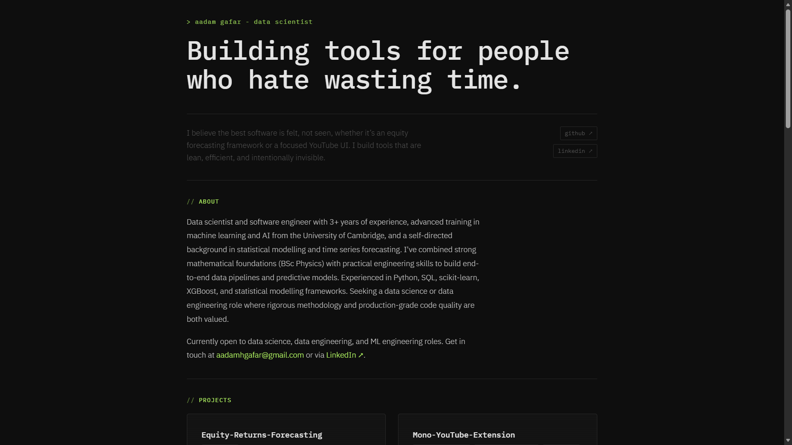

# Personal Website



A personal portfolio and CV, built with plain HTML, CSS, and JavaScript. No frameworks, no dependencies, no build step.

## Features

- Project cards with live GitHub stats (stars, forks, language) fetched from the GitHub API
- Contact form using `mailto:` - no backend, no third-party services
- Responsive layout

## Structure

```
├── index.html
├── style.css
├── main.js
├── art/
│   ├── icon.svg
│   └── screenshot.png
└── README.md
```